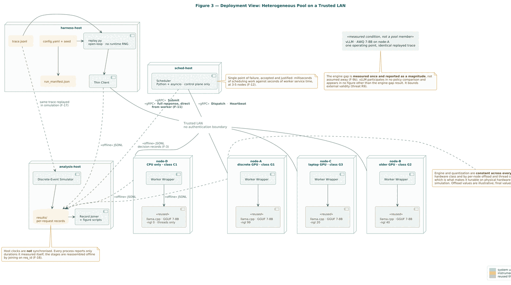
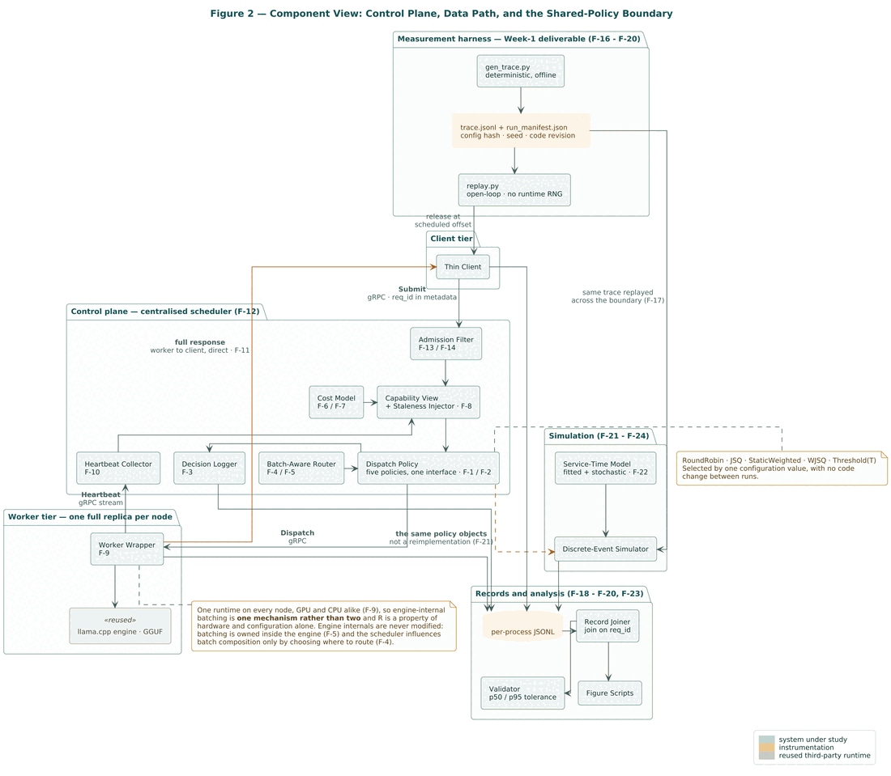

# Scheduling LLM Inference Under Uncalibrated Heterogeneity

A six-week measurement study of how to route language model inference across a pool of
mismatched consumer machines. The scheduler here is an **instrument**, not a product. We
built it to produce measurements, at the lowest fidelity that still supports the claims.

---

## The problem

Four machines of the kind a small lab already owns. A desktop with a discrete GPU, a laptop
with a weaker one, an older GPU box, a CPU-only machine. All serving one model together.

A request arrives. Where does it go?

Two things make this harder than ordinary load balancing.

**The machines differ enormously.** Datacenter hardware generations differ by 2 to 5×.
Consumer machines differ by 10 to 100×. A request that takes 2 seconds on the fast node can
take 3 minutes on the slow one, or blow past any sane timeout entirely. That is a
categorical failure, not a latency tail.

**Nobody knows how fast each node really is.** It can be measured, but the measurement
decays. Serving throughput is non-stationary under sustained load: it drifts with thermal
state, memory pressure, and whatever else happens to be batched alongside. The scheduler is
always routing on an estimate that is already slightly wrong.

The obvious fix is calibration. Measure each node's tokens per second, weight the routing by
it. This study asks whether that is worth doing at all.

> **Research question.** In a pool of consumer machines whose per-node throughput is
> heterogeneous, non-stationary, and known only through stale estimates, does explicit
> hardware calibration improve scheduling **beyond what live queue depth already reveals**,
> and over what range of heterogeneity does that advantage hold?

There is a real reason to doubt it. **Queue depth is already a proxy for speed.** Slow nodes
accumulate queue, so a scheduler that simply joins the shortest queue is implicitly
hardware-aware. Calibration may be paying for something the queue reports for free.

## What we are testing

Three hypotheses. Each falsifiable, each with a negative result worth reporting.

| | Claim | Why it matters |
|---|---|---|
| **H1** | Calibration is largely **redundant** given queue-awareness, and more so as load rises. Formally the interaction is negative: `(WJSQ − JSQ) < (StaticWeighted − RoundRobin)`. | If true, the honest headline contradicts the intuition that motivates hardware-aware schedulers. If false, calibration carries independent signal and we have to say where it comes from. |
| **H2** | The advantage of hardware-aware routing is **non-monotonic** in the heterogeneity ratio *R*. It rises, peaks, and falls back toward zero. | As *R* grows the best policy converges to thresholding, which is round-robin over the strong nodes and is a one-line static rule. Hardware-awareness has a sweet spot, and outside it something trivial matches it. |
| **H3** | Routing quality degrades as the age of a node's estimate approaches the **autocorrelation time τ** of that node's real throughput. | This turns non-stationarity from a threat to the method into the independent variable, and it gives an empirical basis for picking a heartbeat interval instead of guessing one. |

The policies form a **2×2 factorial, not a ladder.** A ladder confounds hardware-knowledge
with queue-knowledge and cannot decompose the gain:

| | Queue-blind | Queue-aware |
|---|---|---|
| **Hardware-blind** | `RoundRobin` | `JSQ` |
| **Hardware-aware** | `StaticWeighted` | `WJSQ` |

Plus `Threshold(T)`, round-robin over nodes above a calibrated cutoff, as the degenerate
baseline H2 predicts `WJSQ` collapses into at high *R*.

## The vocabulary that matters

| Term | What it means here |
|---|---|
| **Prefill / decode** | The two phases of one request. Prefill reads the whole prompt at once and is compute-bound. Decode emits output tokens one at a time and is memory-bandwidth-bound. They scale differently, so we measure them separately. |
| **Heterogeneity ratio *R*** | Fastest node's throughput over slowest, within one pool. The study's primary independent variable. |
| **`-ngl` / `--parallel`** | How many model layers sit on the GPU, and how many requests the engine serves at once. Lowering `-ngl` genuinely slows a node down, which is how we manufacture heterogeneity on hardware we already own. |
| **Autocorrelation time τ** | How long a node's throughput stays correlated with itself. Informally, how long a speed measurement stays useful. |
| **Open-loop load** | The generator sends on a fixed schedule and never waits for a response. Closed-loop would let a slow pool throttle its own workload, silently changing the experiment. |
| **Node class** | One machine under one configuration. The same box at two `-ngl` settings is two node classes, calibrated separately. |
| **Cost model** | A calibrated table predicting service time from prompt length, output length, and concurrency. What a hardware-aware policy consults. |

---

## How it is measured



Machines on a LAN, **all running the same inference runtime**. Holding the engine and the
quantization constant is what makes *R* a property of hardware and configuration alone. A
mixed-engine pool would fold an engine effect into *R*, and none of the three hypotheses can
pull it back out.

We run on two vehicles, and the split between them is the core methodological commitment.

**Hardware** measures what the simulator must not assume: cost-model parameters, τ and the
variance envelope, validation anchors, and the range of *R* real machines can span.

**A discrete-event simulator** provides breadth: node counts to 12, *R* to 100×, controlled
estimate staleness. Four machines reach none of that.

The simulator runs the *same policy code* as the live scheduler, not a reimplementation. It
is parameterized from measured hardware and validated against live runs on identical
replayed traces before any simulated result is believed. Every simulated figure is stamped.

### Three disciplines

Each one guards against something that quietly invalidates measurement studies.

**No duration crosses a host boundary.** Every duration comes from one machine's monotonic
clock. What is left over is reported as a single honest residual, never decomposed into
invented stages. From the two-machine setup onward the assumption behind this is measured
rather than asserted: `clocksync` records each host's clock discipline into the manifest,
and the pipeline divides out the only thing a differing clock can actually corrupt, which is
rate, not offset.

**Open-loop load generation.** The client never waits for a response before firing the next
request, and asserts its own send-lag per request. A run whose timing drifted is marked
invalid rather than analysed.

**Byte-identical trace regeneration.** A trace is reproducible from `(config, seed)` and
identified by its SHA-256, so the same workload replays across every policy and across the
hardware/simulator boundary.

### The pinned engine

*R* is a hardware property only if the engine underneath does not move.

| | |
|---|---|
| Source | [`ggml-org/llama.cpp`](https://github.com/ggml-org/llama.cpp) tag `b10569`, commit `5a32f7b`, plus one patch in [`patches/`](patches) |
| Model | `Llama-3.2-1B-Instruct` GGUF, `Q4_K_M`, the same bytes on every node |
| Backends | CUDA and Vulkan, both built from that one commit |
| Recorded as | `engine_version: b10569+p1+cuda13.2` |

The patch stops `llama-server` throwing a 500 on the `/completion` path when generation ends
mid-character, which it did on roughly 1 request in 100. `llama-server --version` cannot
report a patched tree, which is exactly why the manifest carries `+p1` and the SHA-256 of
the engine's shared libraries. A pin a running node cannot prove is not a pin.

---

## What we have found

**Throughput drift belongs to a particular kind of node.** τ = 69.5 s on the CPU class
(*r²* = 0.989, integrated 89.0 s, 1/e crossing 72.1 s), and nothing measurable on either GPU
class. The instrument limit explains the difference: a node whose τ is shorter than about
five service times cannot show its own drift, and the GPU classes are too fast to resolve
theirs with this workload. That last part is the reusable half. It tells anyone repeating
this what their hardware has to be able to do before the question is even askable.

**Batching buys nothing on this card.** Prefill is flat in concurrency, at 174 / 343 / 698 ms
for prompts of 128 / 256 / 512 tokens. Per-request decode falls almost exactly as 1/c:
143 / 71 / 58 / 39 tok/s at concurrency 1 through 4. Multiply those back out and aggregate
decode throughput is constant. So on a 4 GB consumer GPU, concurrency does not buy
throughput, and the effects the policies compete over here are queueing effects rather than
throughput effects. That is a result about the hardware class the study is *about*.

**The deployed cost model missed its own hardware by 127%.** We found it with `costcheck`, a
diagnostic that asks whether the model a run was served by would have predicted that run.
Two causes, both about grid placement rather than model form: bucket representatives were
calibrated at prompt 64 / output 32 while the traces ran 128 to 512 / 64 to 128, and the
concurrency grid held only {1, 4} while the anchors spent a quarter of their time at 2 slots.
Recalibrating onto the trace's own lengths brought it to **20.8%** request-weighted and
**9.9%** on medians, inside the ±25% tolerance the validation criterion asserts.

**The admissible envelope is `prompt ≤ 512, output ≤ 128`**, with the load band at
**1.03 to 1.30 req/s** on a one-node pool.

*R* is currently **2.00× configured and 1.00× deployable**. That gap is the whole of what is
left, and it is a hardware problem rather than a code one.

---

## Setting up the experiment

Six stages, in order. Each one refuses to proceed on something the previous leaves broken,
which is deliberate: every failure below is silent if it is discovered during a run instead
of before one.

Paths are relative to the repo root for `tools/`, and to `dataplane/` for everything run
through `uv`.

### 1. Machines

Every machine gets surveyed before it is assigned anything. The survey reads only. It needs
no root, installs nothing, and runs on a bare install.

```bash
./tools/survey.sh --json survey-$(hostname).json
```

It answers the three questions that decide a machine's role. Which models fit, computed at
the study's actual shape rather than from weights alone. What `-ngl` and `--threads` range
the machine can produce, which is where *R* comes from. And whether it has the RAM to host
the scheduler and the client instead of an engine.

Roles follow from the answers, not from preference:

| Role | What it runs | Needs |
|---|---|---|
| **Pool node** | one engine, one worker wrapper | a GPU or enough cores, and room for the model |
| **Harness host** | the scheduler and the replay client | about 1.5 GiB of RAM, and no engine |

Nothing is ever both. The client has to fire on a fixed schedule, and an engine will take
the CPU it needs. A late send marks the whole run invalid.

### 2. Nodes

Same engine, same weights, same everything, on every pool node.

```bash
./tools/pool-install.sh --role node --backend cuda --reference 10.42.0.1
./tools/pool-install.sh --role harness --reference 10.42.0.1
```

It prints a plan and waits, because two of these machines belong to other people. It detects
the CUDA architecture from the card rather than assuming ours, refuses to build if the patch
does not apply cleanly, and ends by printing what the node can *prove* about itself: the
build number and commit the server reports, the SHA-256 of the engine's shared libraries,
and the hash of the weights. Those three go into the manifest.

### 3. LAN

The network this study needs is not the one people assume. The worker returns the response
**directly to the client**, so traffic has to flow worker to client, and that is the
direction consumer wireless breaks.

**Not a phone hotspot.** Most of them isolate connected devices from each other, which kills
the reply path silently: the dispatch succeeds, the worker serves the request, the client
records a timeout, and the run reads as a saturated pool.

```bash
./tools/lan-up.sh --ap   --ssid poolnet --pass '<secret>'          # harness host
./tools/lan-up.sh --join --ssid poolnet --pass '<secret>' --ip 10.42.0.11
./tools/lan-up.sh --open node                                      # tcp/50061
./tools/lan-up.sh --verify 10.42.0.1:50051 10.42.0.1:50071
```

Addresses are static because the manifest records where each node was, and an address that
changes between runs makes two runs incomparable. The engine's own port is never opened.

Then the two checks that test what a TCP connect cannot:

```bash
uv run preflight --serve 0.0.0.0:50071        # harness host
uv run preflight --probe <harness>:50071      # from each pool node
uv run clocksync --measure --out clocks/$(hostname).json
uv run clocksync --combine clocks/*.json --reference <harness> --out clock_sync.json
```

`preflight` speaks gRPC, so a port that accepts TCP but not HTTP/2 fails there rather than at
the first request of a run. `clocksync` records each host's clock discipline into the
manifest. The offset it records is subtracted from nothing. The number that matters is the
rate, because Linux slews the monotonic clock along with the system clock, and that is what
makes two machines' durations comparable at all.

### 4. Workers

The engine listens on loopback only. The worker wrapper is the only thing that talks to it,
and the only thing exposed to the LAN.

```bash
~/opt/llama.cpp/b10569-cuda/bin/llama-server \
  --host 127.0.0.1 --port 18080 \
  -m ~/models/gguf/Llama-3.2-1B-Instruct-Q4_K_M.gguf \
  -ngl 99 --threads 6 --parallel 4

uv run worker --node-id gtx1650ti --engine http://127.0.0.1:18080 \
  --bind 0.0.0.0:50061 --engine-version b10569+p1+cuda13.2 --log-dir runs/worker
```

**This is where *R* is set.** A second node running the same engine at a lower `-ngl` is
genuinely slower, and that is how we produce a second *R* point without a second machine.
The settings are part of the experimental condition, so they are recorded per run rather
than per machine.

### 5. Scheduler

Control plane only. It picks a node and steps out of the way, so it never sits in the
response path.

```bash
uv run --project dataplane python fixtures/fake_scheduler/serve.py \
  --bind 0.0.0.0:50051 --worker 10.42.0.11:50061 --worker 10.42.0.12:50061
```

The fixture round-robins blindly and writes no decision record. It exists so neither half of
the project blocks on the other. The real control plane replaces it at the same address.

### 6. Run

One trace, generated once from a config and a seed. It prints its own SHA-256, and the
replay refuses to start unless the file still hashes to it.

```bash
uv run gen-trace configs/trace_anchor_1b.json -o runs/traces/t_lam1.2.jsonl
```

Then one replay per policy, and the whole set again per *R* point. `--advertise` is the
LAN address the worker sends the response back to, which is the F-11 path and the thing
nothing else exercises.

```bash
uv run replay runs/traces/t_lam1.2.jsonl \
  --scheduler 10.42.0.1:50051 --run-id jsq_r1 --policy jsq \
  --sha256 <printed by gen-trace> \
  --bind 0.0.0.0:50071 --advertise 10.42.0.1 \
  --nodes nodes.json --out runs/exp
```

Then the pipeline, which is a pure function of the manifest and the three log files. No
network, no engine, and it runs on a laptop.

```bash
uv run pipeline  runs/exp/jsq_r1 --trace runs/traces/t_lam1.2.jsonl
uv run costcheck runs/exp                                     # before blaming the simulator
uv run runset    runs/exp --out runs/exp/runset.parquet
uv run figures   runs/exp/runset.parquet --out figures/
```

Nothing changes between runs except the policy and the `-ngl` setting. That is the entire
reason the results are comparable.

**Read the manifest before reading any figure.** Four fields decide whether a run is a data
point at all:

| Field | Must be |
|---|---|
| `validity.colocated_nodes` | `0`. One logical node per physical machine, or the contention confound is back. |
| `validity.send_lag_violations` | `0`. Anything else means the client was not open-loop for the whole window. |
| `clock_sync.ok` | `true`, with no host unsynchronised. |
| `nodes[].engine_version` | identical across the pool. |

---

## What it produces even if things go wrong

The window has no slack, so the result ladder is fixed in advance and strictly ordered.

| | | Depends on |
|---|---|---|
| **MPR-1** ✅ | A characterization of throughput non-stationarity in consumer serving nodes: τ, the variance envelope, and the implication that any single calibrated tok/s figure is a moving average over a non-stationary process. | Nothing. Hardware only. |
| **MPR-2** | The H1 2×2 decomposition on real hardware across the synthesized *R* range, plus the load band. | A pool that spans real heterogeneity. |
| **MPR-3** | H2 and H3, the non-monotonic advantage curve and its shift under staleness, in the validated simulator. | Weeks 5 to 6. |

MPR-1 stands alone as a measurement contribution and needs no scheduler comparison, which is
exactly why it is the one that has landed.

---

## Repository layout

```
contracts/     The interface between the two halves. Six frozen artifacts, plus the
               committed cost-model snapshot series the simulator reads.
dataplane/     Workers, calibration campaign, harness, results pipeline.   (Python)
controlplane/  Scheduler, the five policies, discrete-event simulator.     (Java)
tools/         Machine survey, LAN bring-up, pool install.
fixtures/      Fake scheduler and fake worker, so neither half blocks on the other.
docs/          Spec, decision records, UML figure set.
patches/       Changes to the pinned engine, with the reasoning that justifies them.
runs/          Measurement output. Only manifests and determinations are versioned.
```



### The contract

The two halves interact through exactly six artifacts and **nothing else crosses the seam**.
All six are validated in CI on every pull request.

| # | Artifact | Direction |
|---|---|---|
| C-1 | [`scheduling.proto`](contracts/scheduling.proto) | bidirectional |
| C-2 | [Trace file](contracts/schemas/trace.schema.json) | harness to harness and simulator |
| C-3 | [Cost model snapshot](contracts/schemas/cost_model.schema.json) | data plane to control plane |
| C-4 | Log records ([client](contracts/schemas/log_client.schema.json), [scheduler](contracts/schemas/log_scheduler.schema.json), [worker](contracts/schemas/log_worker.schema.json)) | both to pipeline |
| C-5 | [Joined record](contracts/schemas/joined_record.schema.json) | pipeline to figures |
| C-6 | [Run manifest](contracts/schemas/manifest.schema.json) | launcher to everything |

Only C-1 and C-3 are runtime couplings. The rest are file formats, so both halves develop
against fixtures without waiting on each other.

**Why the seam sits there.** The binding constraint is that the simulator must run the same
policy implementations as the live scheduler. Split those across two people and they drift,
not maliciously but through ordinary divergence over tie-breaking, or over whether an
in-flight request counts before or after admission. That drift invalidates validation
*silently*, because both systems still run and still produce plausible numbers. So one
person owns the policy code and both of its hosts, and everything else is arranged around
that.

## Getting started

Requires [`uv`](https://docs.astral.sh/uv/). No GPU needed to run the checks.

```bash
uv run contracts/check.py                          # the six artifacts
cd dataplane && uv sync --all-groups && uv run pytest
```

`check.py` also validates an arbitrary file against the contract its name implies, which
is how either side checks output before pushing it rather than after the other side's
pipeline rejects it:

```bash
uv run contracts/check.py --validate runs/exp/jsq_r1/scheduler_jsq_r1.jsonl
```

## Documentation

| | |
|---|---|
| [Requirements specification](docs/scheduling-requirements-spec.pdf) | Scope, hypotheses, F-1 to F-24, non-goals, threats to validity, the MPR ladder. The authority for everything else. |
| [Split and interface contract](docs/two-person-split-and-interface-contract.md) | Where the seam is, the six artifacts across it, and the failure modes to watch. |
| [Week-1 freeze checklist](docs/week1-freeze-checklist.md) | What had to be true before the contract froze, and the record of every week since. |
| [UML figure set](docs/uml/FIGURES.md) | Twelve figures with captions and the requirements each discharges. |

## Project status

Six weeks, no slack. Feature freeze at the end of Week 3, contract freeze at the end of
Week 1.

| Week | Focus | |
|---|---|---|
| 1 | Worker, heartbeat, client, harness. One query routed and measured end to end. | ✅ |
| 2 | Calibration campaign, τ and the variance envelope, the synthesizable *R* range. **MPR-1.** | ✅ |
| 3 | All five policies behind one config value, admissible set, load band. **Feature freeze.** | ✅ |
| 4 | Pipeline and figures; simulator sharing policy code, validated against hardware. | data plane ✅ |
| 5 | Sweeps: *R* × load × staleness × policy. Hypotheses tested. | |
| 6 | Analysis, threats to validity, positioning, writeup. Engine-gap measurement. | |

## Team

| | | |
|---|---|---|
| **Divyansh Shukla** (A) | [@divyanshuklai](https://github.com/divyanshuklai) | Data plane and measurement. Workers, calibration, harness, pipeline, figures. |
| **Aditya Gupta** (B) | [@adityaxgupta](https://github.com/adityaxgupta) | Control plane and simulation. Scheduler, policies, staleness injection, simulator, validation. |

Ownership marks primary responsibility, not exclusive access. Both of us can run the full
stack.
